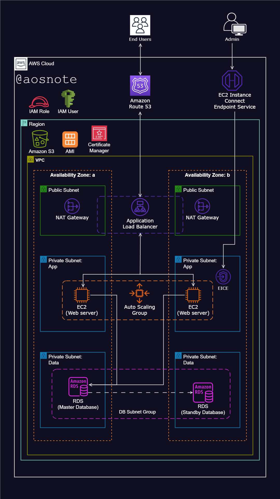

---
# Dynamic Web Application Deployment on AWS

This project demonstrates the deployment of a dynamic web application on AWS using various cloud services for scalability, security, and high availability. The setup ensures a reliable and secure environment for hosting a web application with an integrated database.

## Architecture Overview
The application is hosted on EC2 instances within a Virtual Private Cloud (VPC) and is accessible via an Application Load Balancer (ALB). The architecture includes private and public subnets across two availability zones, an autoscaling group for high availability, and secure access management through IAM roles and security groups.

## Resources Utilized

1. **VPC with Public and Private Subnets (Across Two Availability Zones)**  
   - Provides network isolation and segmentation for improved security and organization.

2. **Internet Gateway**  
   - Enables connectivity between public resources within the VPC and the internet.

3. **NAT Gateway (Deployed in Public Subnet)**  
   - Facilitates outbound internet access for EC2 instances in private subnets while preventing unsolicited inbound traffic from the internet, enhancing security.

4. **Multiple Availability Zones**  
   - Ensures system reliability and fault tolerance by distributing resources across different physical locations.

5. **Application Load Balancer (ALB) (Deployed in Public Subnets)**  
   - Distributes incoming web traffic evenly across EC2 instances to enhance availability, reliability, and fault tolerance.

6. **Private Subnets (Hosting Web Servers and RDS Database)**  
   - Enhances security by restricting direct internet access to critical application components.

7. **Security Groups**  
   - Acts as a firewall mechanism to control inbound and outbound traffic to AWS resources.

8. **EC2 Instance Connect Endpoint (Deployed in Private Subnet)**  
   - Provides a secure method to connect to EC2 instances in private subnets without exposing them to the internet.

9. **Autoscaling Groups**  
   - Dynamically manages the number of EC2 instances in private subnets, ensuring application availability, scalability, and fault tolerance.

10. **Amazon S3**  
   - Stores project web files securely and provides a scalable storage solution.

11. **IAM Role**  
   - Grants secure access permissions for EC2 instances to interact with S3, following the principle of least privilege.

12. **AWS Certificate Manager**  
   - Ensures secure communication between application components via SSL/TLS certificates.

13. **Amazon Machine Image (AMI) and Launch Template**  
   - Automates the deployment and configuration of EC2 instances for consistent and repeatable server provisioning.

14. **Route 53**  
   - Provides domain name registration and DNS routing for user-friendly application access.

## Deployment Scripts
Deployment scripts used for hosting the application are available in the GitHub repository:
[GitHub Repository](https://github.com/tifedaramola/Dynamic-web-app-AWS.git)

These scripts facilitate:
- Downloading and hosting web files on EC2 instances.
- Configuring necessary services and dependencies.
- Automating deployment processes for efficiency.

## Conclusion
This project successfully demonstrates the deployment of a dynamic web application on AWS with a highly available, scalable, and secure architecture. The integration of multiple AWS services ensures optimal performance, security, and ease of management.

